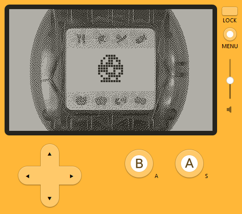

# PlaydateGotchi

PlayGotchi is a Tamagotchi P1 emulator for the Playdate relying on the hardware agnostic Tamagotchi P1 emulation library [TamaLIB](https://github.com/jcrona/tamalib/).



PlayGotchi being an emulator, it requires a compatible Tamagotchi P1 ROM named rom.bin and placed in the Source/ folder.
You have to find it yourself.

## Build instruction
```
$ git clone --recursive https://github.com/nokotchi/PlayGotchi.git
```
Then follow the instructions for your OS from here: https://sdk.play.date/inside-playdate-with-c#_cmake

## Notes
- Left button ("A") is right arrow.
- Middle button ("B") is B.
- Right button ("C") is A.
- To activate your pet, you have to configure the clock by pressing the middle button.